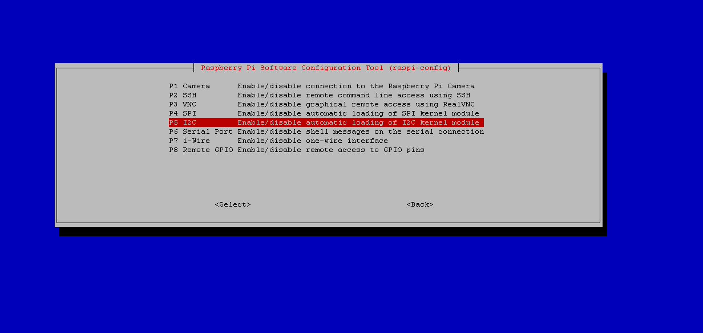

# Configuração do Serviço De Monitoramento

1. Pré-requisito, executar comando para instalação do PIP
```bash
sudo apt-get install python3-pip
```

### Físico


1. Pré-requisito, executar comando para instalação de pacotes
```bash
sudo apt-get install python3-pil
sudo apt-get install python3-smbus
sudo apt-get install git
git clone https://github.com/adafruit/Adafruit_Python_SSD1306.git
cd Adafruit_Python_SSD1306
sudo python3 setup.py install
```

2. Execute o comando, para habilidar I2C
```bash
sudo raspi-config 
```


3. Selecione a Opção Interface Options 



4. Selecione a Opção I2C 


5. Selecione a Opção "YES"
   
### Virtual

#### Web


#### Mobile


1. Pré-requisito, executar comando para instalação de pacotes
 
```bash
sudo pip3 install flask
```