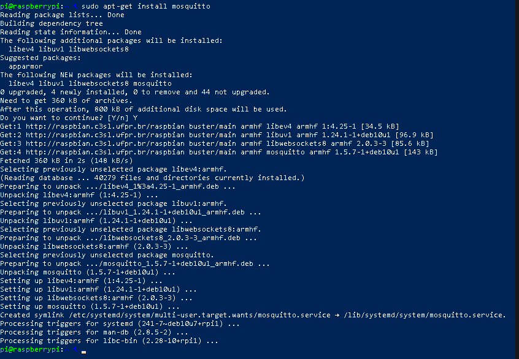
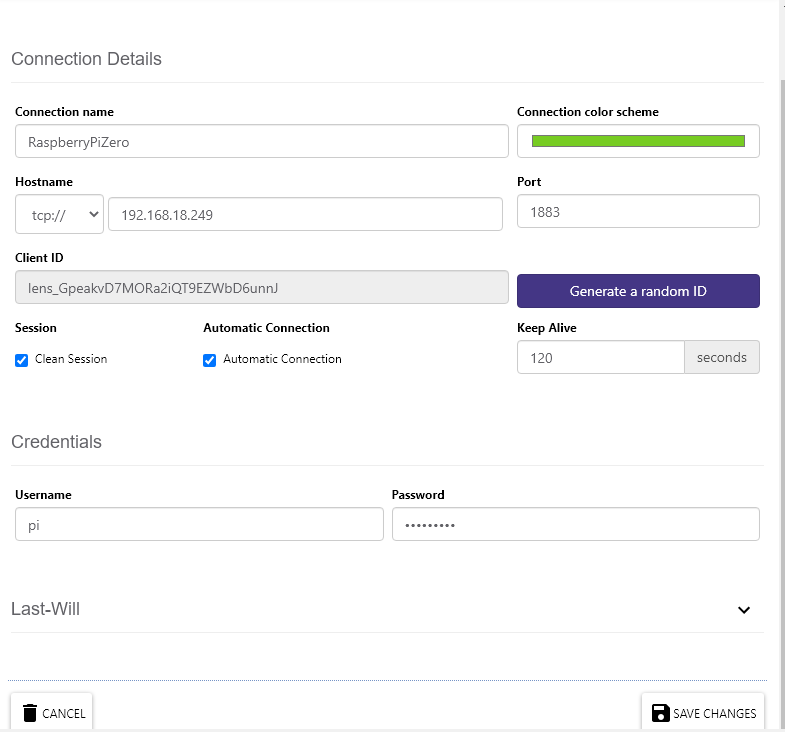
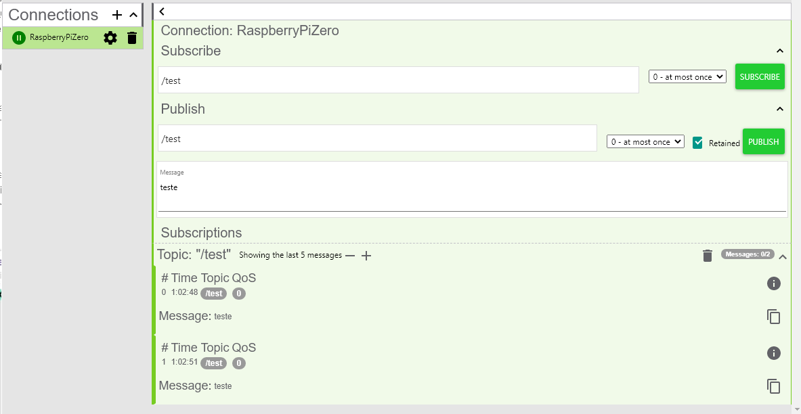
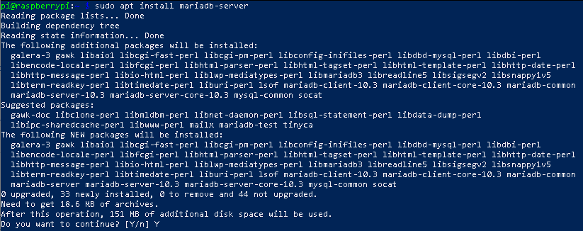
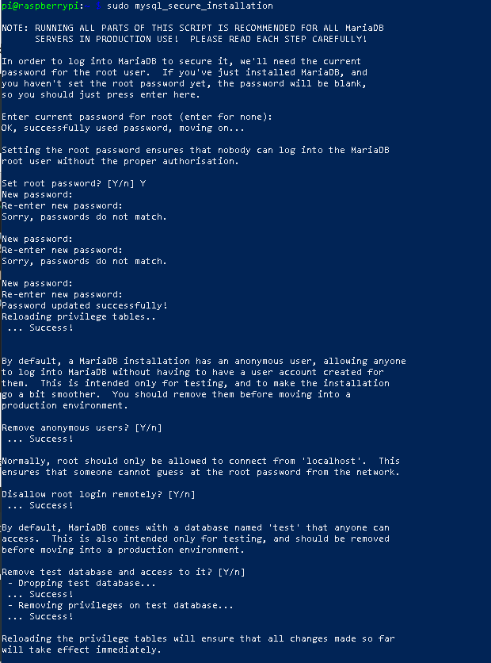
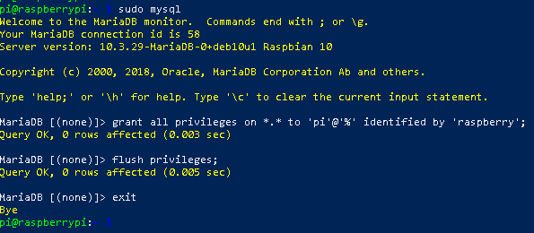
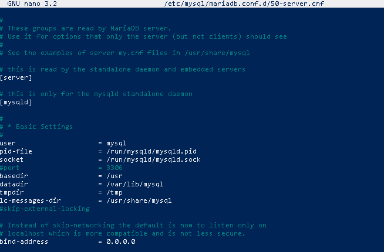
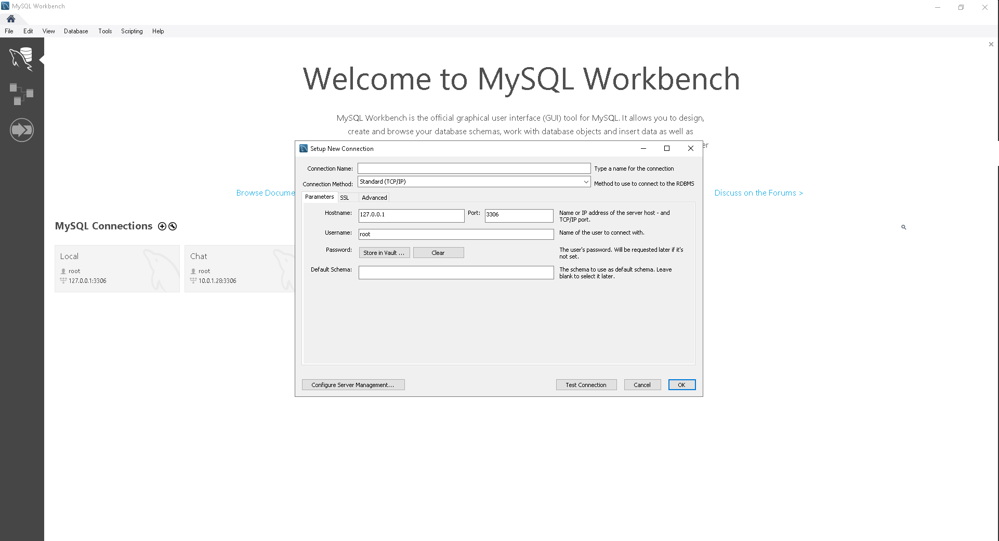

# Configuração de Serviçoes no Servidor

### MQTT

MQTT, sigla de Message Queuing Telemetry Transport, é um protocolo de mensagens leve para sensores e pequenos dispositivos móveis otimizado para redes TCP/IP. O esquema de troca de mensagens é fundamentado no modelo Publicador-Subscritor, extremamente simples e leve. Os princípios arquitetônicos são minimizar o uso de banda de rede e uso de recursos dos equipamentos enquanto garantindo confiabilidade e algum nível de garantia de entrega. Estes princípios tornam esse protocolo ideal para as comunicações emergentes (M2M) “machine-to-machine” e para as aplicações “Internet of Things” (Internet das coisas) um mundo de equipamentos conectados, além das aplicações mobile onde banda e potência da bateria são relevantes. Atualmente se encontra na versão 5.0 e a 3.1.1 (padrão ISO), ambos são padrões OASIS. MQTT-SN é uma variação do protocolo destinada a redes que não sejam baseadas em TCP/IP, como ZigBee. MQTT hoje é usado em uma ampla variedade de indústrias, como automotiva, manufatura, telecomunicações, petróleo e gás, etc.

*Fonte:https://pt.wikipedia.org/wiki/MQTT*

### MYSQL(MariaDB)

O MySQL é um sistema de gerenciamento de banco de dados (SGBD), que utiliza a linguagem SQL (Linguagem de Consulta Estruturada, do inglês Structured Query Language) como interface. É atualmente um dos sistemas de gerenciamento de bancos de dados mais populares da Oracle Corporation, com mais de 10 milhões de instalações pelo mundo.

Entre os usuários do banco de dados MySQL estão: NASA, Friendster, Banco Bradesco, Dataprev, HP, Nokia, Sony, Lufthansa, U.S. Army, U.S. Federal Reserve Bank, Associated Press, Alcatel, Slashdot, Cisco Systems, Google, entre outros.

MariaDB é um SGBD que surgiu como fork do MySQL, criado pelo próprio fundador do projeto após sua aquisição pela Oracle

*Fonte:https://pt.wikipedia.org/wiki/MySQL*

### Instalando Serviço Broker MQTT

1.Conectado no seu Raspberry PI Zero W usando ssh execute o comando, se solicitado confinação de continuidade digite ¨Y¨ 
```bash
sudo apt-get install mosquitto
```



### Testando Serviço Broker MQTT

1. Acesse o Link https://chrome.google.com/webstore/detail/mqttlens/hemojaaeigabkbcookmlgmdigohjobjm/related para instalar uma extensão do google Chrome para realizar teste no mqtt 


2. Adicionando nova Connections
   1. Connection Name: RaspberryPiZero
   2. Hostname: tcp:// 192.168.18.249 
   3. Port: 1883
   4. Username:pi
   5. Password:raspberry
   6. Salvar



3. Se tudo estiver certo, conectar no serviço e testar 




### Instalando Serviço MYSQL Server

1. Conectado no seu Raspberry PI Zero W usando ssh execute o comando, se solicitado confinação de continuidade digite ¨Y¨

```bash
sudo apt-get install mysql-server
```




2. execute o comando para configurar o MYSQL
   1. Enter current password for root (enter for none): [Enter]
   2. Set root password? [Y/n]: [Enter]
   3. New password: raspberry
   4. Re-enter new password: raspberry
   5. Remove anonymous users? [Y/n] : [Enter]
   6. Disallow root login remotely? [Y/n] : [Enter]
   7. Remove test database and access to it? [Y/n] : [Enter]

```bash
sudo mysql_secure_installation
```



3. Criando usuario para acesso externo,execute os comando em ordem

```bash
sudo mysql
grant all privileges on *.* to 'pi'@'%' identified by 'raspberry';
flush privileges;
exit
```


4. Configuração do acesso remoto,execute os comando para editar aquivo /etc/mysql/mariadb.conf.d/50-server.cnf na linha bind-address alterar de 127.0.0.1 para 0.0.0.0 
```bash
sudo nano /etc/mysql/mariadb.conf.d/50-server.cnf
```



5. Reinicie Serviço mariadb
```bash
sudo systemctl restart mariadb
```

   
### Testando Serviço MSQL

1. Acesse o Link https://dev.mysql.com/downloads/workbench/ para baixar MySQL Workbench e instale em sua maquina Local



2. Adicionando nova Connections
   1. Connection Name: RaspberryPiZero
   2. Hostname: 192.168.18.249 
   3. Port: 3306
   4. Username:pi
   5. Password:raspberry
   6. OK


[Configuração do Serviço De Monitoramento](ConfiguracaoServicoMonitoramento.md)