# Instalação Servidor 
### Raspberry Pi Zero W

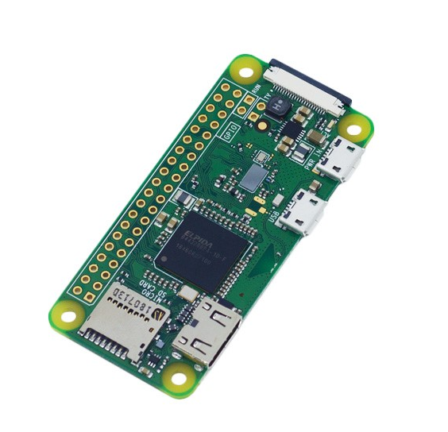

A Raspberry Pi Zero W é uma placa de baixo custo com um tamanho reduzido (apenas 6,5 x 3cm), permitindo que você crie projetos compactos sem perder a flexibilidade que as placas da linha Raspberry proporcionam.

A placa conta com WiFi e Bluetooth integrados, eliminando assim, a necessidade de usar adaptadores na porta USB. O seu processador é o Broadcom BCM2835 single-core de 1GHz que, aliado à memória de 512MB, permite que você crie aplicações controlando a GPIO de 40 pinos, desenvolva projetos de IoT ou simplesmente se divirta rodando um emulador de videogames

*Fonte:https://www.filipeflop.com/produto/raspberry-pi-zero-w/*

### Raspberry Pi OS Lite

Raspberry PI OS Lite é um sistema operacional mínimo. Ele atende às necessidades de sistemas operacionais muito leves com um conjunto mínimo de pacotes. É sugerido apenas para experientes pessoas capazes de fazer conexões ssh e gerenciamento remoto com uma Interface de Linha de Comando (CLI)

*Fonte:https://peppe8o.com/raspberry-pi-os-lite-vs-desktop/*


### Instalando Raspberry Pi OS Lite no Raspberry Pi Zero W

1. Acessar Link https://www.raspberrypi.org/software/ para Download Raspberry Pi Imager é a maneira rápida e fácil de instalar o Raspberry Pi OS em um cartão microSD, pronto para usar com o Raspberry Pi Zero W,Selecionar sistema operacional, no meu caso será feito a instalação a partir de um Windows 10

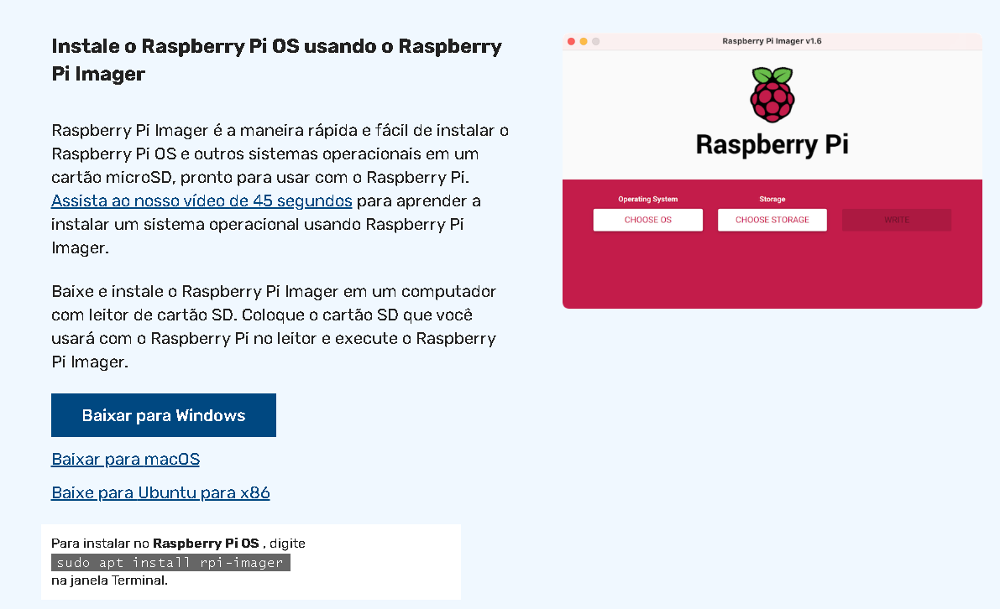

2. Será realizado o download de uma arquivo EXE na pasta de download com o nome parecido com "imager_x.x.x.exe", executar arquivo e avançar para iniciar a instalaçãon, ao finalizar será executado o Raspberry Pi Imager

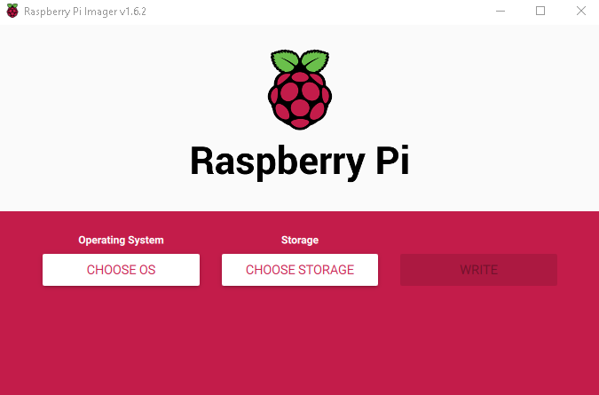

3. Clique em "CHOOSE OS" para selecionar o "Operating System" 

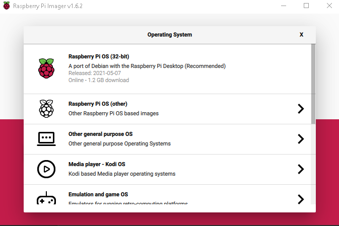

4. Clique em "Raspberry PI os (other)"

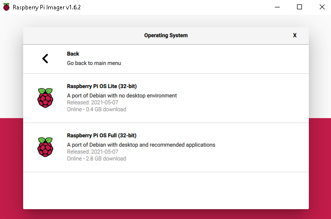

5. Clique em "Raspberry PI OS Lite (32-bit)", para selecionar o system operacional que será instalado em um cartão microSD

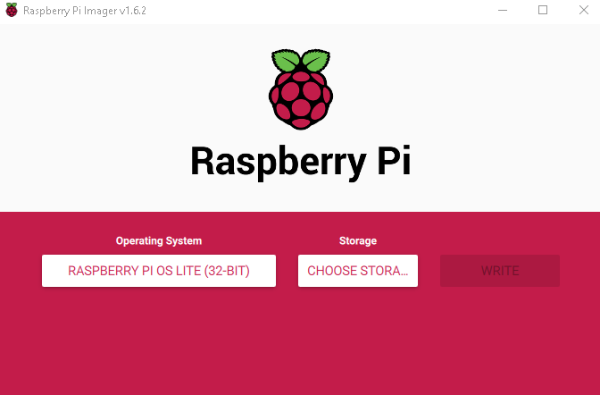

6. Clique em "CHOOSE STORAGE", para selecionar nosso cartão microSD

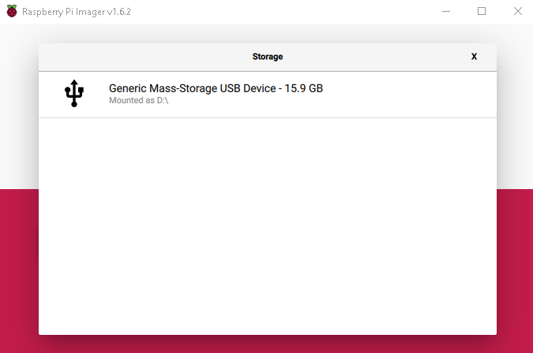

7. Como no meu caso só tem o microSD de 16GB inserido em minha máquina só apareceu ele na lista para selecionar, clique em cima do seu microSD para selecionar 

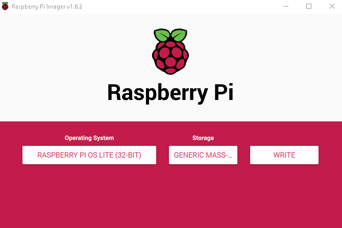

8. Se tudo estiver certo o botão "WRITE" vai está liberado para clicar e começar a instalação, aguarde finalizar  

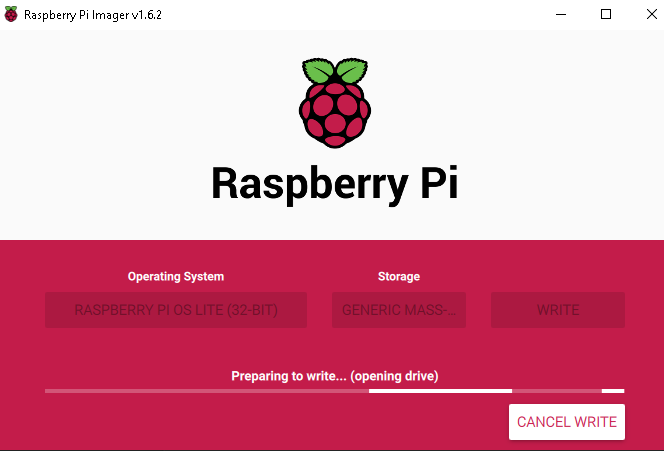

9. Se aparecer uma mensagem de "Write Successful", foi finalizado a instalação com sucesso e só clicar em "Continue" e retirar o seu microSD e Inserir no Raspberry Pi Zero W 


10. Ligue o Raspberry Pi Zero W na emergia e em um monitor e um teclado para configuração iniciar para liberar o acesso ssh e conectar no Wifi


11. Para Logar no raspberry pi os o *usuario : pi* e a *senha : raspberry*


12. Execute o comando, para realizar comfiguração de Wifi e SSH
```bash
sudo raspi-config 
```


13. Selecione a Opção System Options


14. Selecione a Opção Wireless LAN


15. Selecione a País 


16. Entre com o nome da  rede wifi


17. Entre com o senha da  rede wifi


18. Selecione a Opção Interface Options 


19. Selecione a Opção SSH 


20. Selecione a Opção "YES"


21. Selecione a Opção "Finish"
    


22.  Execute o comando, para Pegar o IP do Raspberry Pi Zero W na Rede,para assim realizar o acesso remoto via ssh
```bash
ifconfig
```

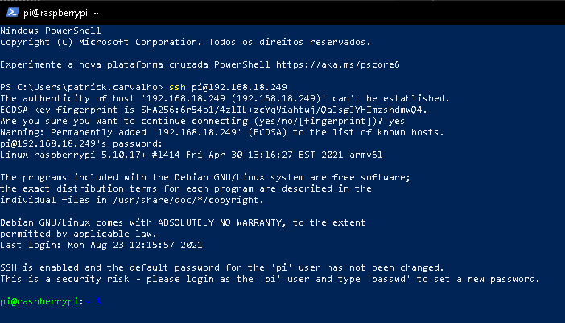

23. Em outra maquina iniciar o powershell e execute o comando  ssh USUARIO@IP,para acessar uma maquina remota, digite "yes" para aceitar a key de authenticity e entre com a senha do usuario
```bash
ssh pi@192.168.18.249
```

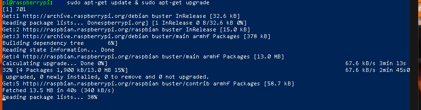

23. Execute os comandos para atualizar os pacote
```bash
sudo apt-get update & sudo apt-get upgrade
```

[Configuração de Servições no Servidor](ConfiguracaoServicoes.md)